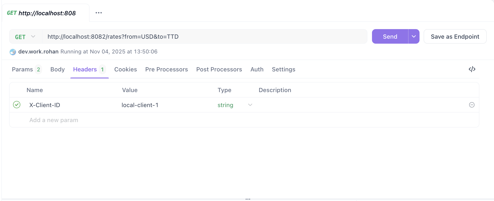

# Project Overview: Forex Proxy Service

A proxy service to convert the currency pair rates with handling **OneFrame quota** and **orchestrate** the request by implementing below features.

## Features

- **Asynchronous Batch Fetching [Important]**:
  - Fetches and caches actively used currency pairs in bulk at scheduled intervals to improve performance and reduce API calls.
- **Redis Caching [Important]**:
  - Caches exchange rates in Redis to reduce external API calls and optimize quota usage.

- **Retry with Exponential Backoff**:
  - Automatically retries failed external API requests with a backoff mechanism to gracefully handle temporary service failures.
- **Request Coalescing [Important]**:
  - Combines multiple requests with identical parameters into a single API call to reduce load on the external service and minimize quota usage.
- **Circuit Breaker**:
  - Implements fault tolerance by stopping repeated failed requests when the external service is down, preventing cascading failures.
- **External API Health Check**:
  - Continuously monitors the availability of the external API.  
  - When the service becomes available again, cached rates are refreshed immediately to minimize API calls during batch intervals.
- **Rate Limiting [Important]**
  - Enforces **IP-based rate limiting** to protect the OneFrame against multiple calls which can lead to exhaust **quota**.
    - Redis cache hits are **excluded** from rate limiting.
    - Includes a **client whitelist mechanism** that exempts trusted clients.
- **Persistent Storage / Historical Data**:
  - Stores historical exchange rate data in **Cassandra DB** for analytical and auditing purposes.
- **Structured Logging**:
  - Implements dedicated loggers for:
    - Application events  
    - Cache operations [HIT, MISS, PUT]
    - Database transactions
    - Garbage collection
- **Toggle all features with enable flag**:
  - Enable/Disable the feature by toggling the flag in [project configuration](src/main/resources/application.conf)


## Usage

- Start the docker-compose containing
  - Oneframe Service
  - Redis DB (must start before application)
  - Redis UI
  - Cassandra DB

```bash
docker-compose -d up
```

- Start the application using sbt

```bash
sbt clean run
```

## APIs exposed

- /rates?xxx&xxx

### Example
```bash
http://localhost:8082/rates?from=USD&to=TTD


```
Note: Also, you can whitelist the client to avoid rate limiting by adding a client-id in the header and specifying in the [configuration](https://github.com/Rohan1203/forex-proxy/blob/main/src/main/resources/application.conf#L44)



## Example

```bash
$ docker-compose up -d                                    1 ↵
[+] Running 4/4
 ✔ Container oneframe   Started
 ✔ Container redis      Started
 ✔ Container cassandra  Started
 ✔ Container redis-ui   Started 

$ sbt clean run
[info] welcome to sbt 1.8.0 (Oracle Corporation Java 17.0.12)
[info] loading settings for project forex-proxy-build-build-build from metals.sbt ...
[info] loading project definition from /Users/ts-rohan.das/forex-proxy/project/project/project
[info] loading settings for project forex-proxy-build-build from metals.sbt ...
[info] loading project definition from /Users/ts-rohan.das/forex-proxy/project/project
[success] Generated .bloop/forex-proxy-build-build.json
[success] Total time: 1 s, completed Nov 4, 2025, 4:27:31 PM
[info] loading settings for project forex-proxy-build from metals.sbt,plugins.sbt ...
[info] loading project definition from /Users/ts-rohan.das/forex-proxy/project
[success] Generated .bloop/forex-proxy-build.json
[success] Total time: 1 s, completed Nov 4, 2025, 4:27:32 PM
[info] loading settings for project forex-proxy from build.sbt ...
[info] set current project to forex (in build file:/Users/ts-rohan.das/forex-proxy/)
[success] Total time: 0 s, completed Nov 4, 2025, 4:27:32 PM
[info] compiling 34 Scala sources to /Users/ts-rohan.das/forex-proxy/target/scala-2.13/classes ...
[info] running forex.Main 
2025-11-04 16:27:40.525 [sbt-bg-threads-1] INFO  forex.Main$ - starting forex proxy application
2025-11-04 16:27:40.692 [ioapp-compute-0] INFO  forex.Application - loading configuration
2025-11-04 16:27:40.847 [ioapp-compute-0] INFO  forex.Application - configuration loaded: forex-proxy v1.0.1
2025-11-04 16:27:40.847 [ioapp-compute-0] INFO  forex.Application - creating http client for oneframe api
2025-11-04 16:27:41.277 [ioapp-compute-0] INFO  forex.Application - connecting to redis at localhost:6379
2025-11-04 16:27:41.555 [ioapp-compute-4] INFO  forex.Application - redis connection established
2025-11-04 16:27:41.555 [ioapp-compute-4] INFO  forex.Application - connecting to cassandra...
2025-11-04 16:27:41.636 [ioapp-compute-4] INFO  c.d.o.d.i.c.DefaultMavenCoordinates - DataStax Java driver for Apache Cassandra(R) (com.datastax.oss:java-driver-core) version 4.15.0
2025-11-04 16:27:41.951 [s0-admin-0] INFO  c.d.o.d.internal.core.time.Clock - Using native clock for microsecond precision
2025-11-04 16:27:42.252 [ioapp-compute-4] INFO  forex.Application - cassandra connection established
2025-11-04 16:27:42.253 [ioapp-compute-4] INFO  forex.Application - initializing application module
2025-11-04 16:27:42.277 [ioapp-compute-4] INFO  f.s.r.interpreters.OneFrameClient - fetching rates from oneframe api
2025-11-04 16:27:42.278 [ioapp-compute-4] INFO  f.s.batch.OneFrameBatchScheduler - starting oneframe batch scheduler
2025-11-04 16:27:42.279 [ioapp-compute-4] INFO  f.s.r.interpreters.OneFrameClient - fetching rates from oneframe api
2025-11-04 16:27:42.500 [ioapp-compute-4] INFO  f.s.health.OneFrameHealthChecker - starting oneframe health checker (interval: 15s)
2025-11-04 16:27:42.501 [ioapp-compute-4] INFO  forex.Application - starting oneframe batch scheduler
2025-11-04 16:27:42.502 [ioapp-compute-4] INFO  forex.Application - oneframe batch scheduler started in background
2025-11-04 16:27:42.502 [ioapp-compute-4] INFO  forex.Application - starting oneframe health checker
2025-11-04 16:27:42.503 [ioapp-compute-4] INFO  forex.Application - oneframe health checker started in background
2025-11-04 16:27:42.503 [ioapp-compute-4] INFO  forex.Application - starting http server on http://0.0.0.0:8082
2025-11-04 16:27:43.069 [ioapp-compute-1] DEBUG f.s.circuitbreaker.CircuitBreaker - circuit breaker: request succeeded
2025-11-04 16:27:43.080 [ioapp-compute-6] INFO  f.s.apitracker.OneFrameApiTracker - oneframe api call tracked: endpoint=/rates pairs=306 success=true quota=82/1000
2025-11-04 16:27:43.080 [ioapp-compute-6] INFO  f.s.r.interpreters.OneFrameClient - caching 306 rates in redis (ttl: 5m)
2025-11-04 16:27:43.267 [ioapp-compute-2] INFO  f.s.r.interpreters.OneFrameClient - cache updated: 306 rates stored in 985ms
2025-11-04 16:27:43.952 [ioapp-compute-7] INFO  f.s.c.CassandraRatesRepository - stored 306 rates in cassandra (688ms)
2025-11-04 16:27:43.953 [ioapp-compute-7] DEBUG f.s.r.interpreters.OneFrameClient - cassandra batch write completed: 306 rates
2025-11-04 16:27:57.548 [ioapp-compute-5] INFO  f.s.health.OneFrameHealthChecker - oneframe api status: healthy (status: 404)
```

## Improvements

- Can improve the db design
- Can implement request debounce with queue to protect the cache miss
- fix redis connection pool, which impact the application start up